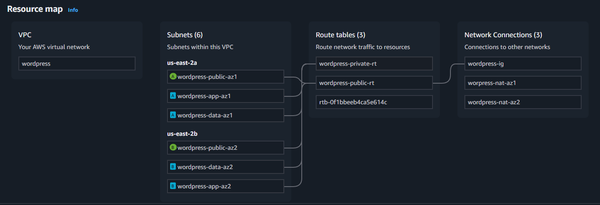

O objetivo do projeto foi implantar a plataforma Wordpress na nuvem AWS de forma escalável e tolerante a falhas, utilizando os principais serviços gerenciados da AWS para garantir desempenho e disponibilidade. Para isso a aplicação foi distribuída em múltiplas instâncias EC2 por meio de um ASG (Auto Scaling Group), com balanceamento de carga fornecido por um ALB (Application Load Balancer). O armazenamento de arquivos foi centralizado e compartilhado por meio de um EFS (Elastic File System), enquanto os dados da aplicação foram armazenados em um banco relacional altamente disponível com o Amazon RDS.

# Serviços e Tecnologias

O objetivo desta sessão é apresentar um resumo básico dos recursos/serviços utilizados e o papel que cada um deles desempenha no funcionamento da aplicação, para conferir o passo a passo da implementação e as configurações do ambiente [clique aqui](Infrastructure/README.md).

### VPC (Virtual Private Cloud)
Ao invés de concentrar todos os recursos em uma única AZ (Availability Zone), a VPC foi distribuida entre duas AZs diferentes. O principal objetivo disso é disponibilidade e resiliência, se uma AZ cair, outra continua operando. A VPC multi-az foi criada com 6 subnets (2 públicas e 4 privadas), Route Tables, NAT Gateway e Internet Gateway.

Para atender as demandas de disponibiidade, as subnets também foram distribuidas em duas AZs diferentes (az-1 e az-2). Com relação às subnets privadas, afim de isolar banco de dados de instâncias, há difereciação entre subnets para dados (data-az1 e data-az2) e subnets para aplicações (app-az1 e app-az2).

O NAT Gateway foi criado para permitir que as intancias nas subnets destiandas a aplicação (app) acessassem a internet sem exposição direta, desse modo as intancias podem receber atualizações, downloads e etc sem compromoter a segurança do ambiente. Foram configurados dois NAT Gateways, um em cada subnet pública, para que as subnetes em ambas as AZs tivessem essa conexão controlada à internet.

O Internet Gateway permite que recursos nas subnets públicas se conectem à Internet e também que os recursos na Internet iniciem uma conexão com eles usando o endereço IPv4 público.

### ASG (Auto Scaling Group)
Assegura disponibilidade gerenciando o número de instâncias de acordo com a demanda e parâmetros definidos durante sua criação. Foi criado com escalamento baseado em CPU, ou seja, garante que as solicitações dos usuários sejam processadas rapidamente, utilizando a capacidade de cada máquina de forma eficiente. 

### ALB (Application Load Balancer)
Distribui tráfego HTTP para instâncias da aplicação. Foi criado com listener na Portas 80 (HTTP) e com target groups apontando para instâncias EC2, criadas pelo ASG, nas subnets privadas.

### RDS (Relational Database Service)
Banco de dados relacional gerenciado pela própria AWS. Foi criado em uma das subnets privadas destinada aos dados e utilizando uma imagem MySQL.

### EFS (Elastic File System)
Proporciona armazenamento compartilhado e escalável para múltiplas instâncias. Foi configurado com dois Mount Targets, cada um em uma az, e com o EFS Infrequent Access para otimizar os custos. A montagem ocorre dentro das instâncias EC2 via NFS.

# Produto Final

 

# Melhorias Futuras

- Infrastructure as Code com Terraform ou CloudFormation
- Variáveis de ambientes e dados sensíveis gerencias pelo Secrets Manager
- Integração com o discord para monitorar o status da página
