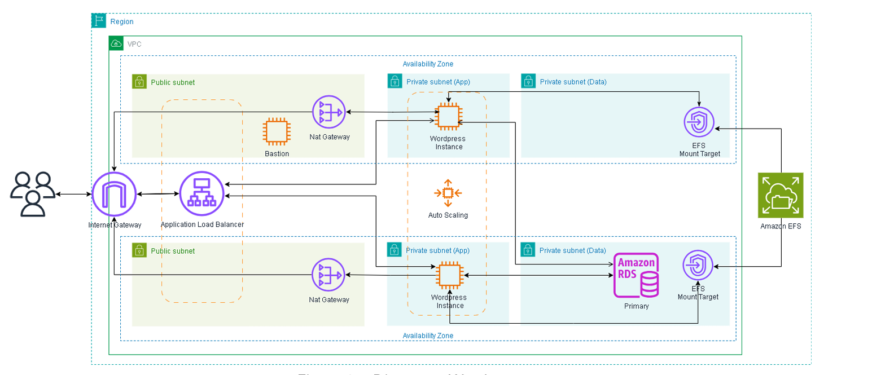

O objetivo do projeto foi implantar a plataforma Wordpress na nuvem AWS de forma escalável e tolerante a falhas, utilizando os principais serviços gerenciados da AWS para garantir desempenho e disponibilidade. Para isso a aplicação foi distribuída em múltiplas instâncias EC2 por meio de um ASG (Auto Scaling Group), com balanceamento de carga fornecido por um ALB (Application Load Balancer). O armazenamento de arquivos foi centralizado e compartilhado por meio de um EFS (Elastic File System), enquanto os dados da aplicação foram armazenados em um banco relacional altamente disponível com o Amazon RDS.

# Índice
- [Infraestrutura](#infraestrutura)
- [Tecnologias ultilizadas](#tecnologias-ultilizadas)

# Infraestrutura
### Subnets
Ao todo foram criadas 6 subnets: 2 públicas e 4 privadas. As subnets foram configuradas para atender as demandas de disponibiidade, por isso foram distribuidas em duas AZs (Availability Zones) diferentes (az-1 e az-2). Além disso, as subnets criadas se difereciam entre dados (data-az1 e data-az2) e aplicações (app-az1 e app-az2) com o objetivo de isolar o banco de dados das instâncias.

### NAT Gateway
Para permitir que as instâncias tivessem saída para a internet foram configurados 2 NAT Gateways, um em cada AZ.

### NAT Gateway

# Tecnologias ultilizadas

